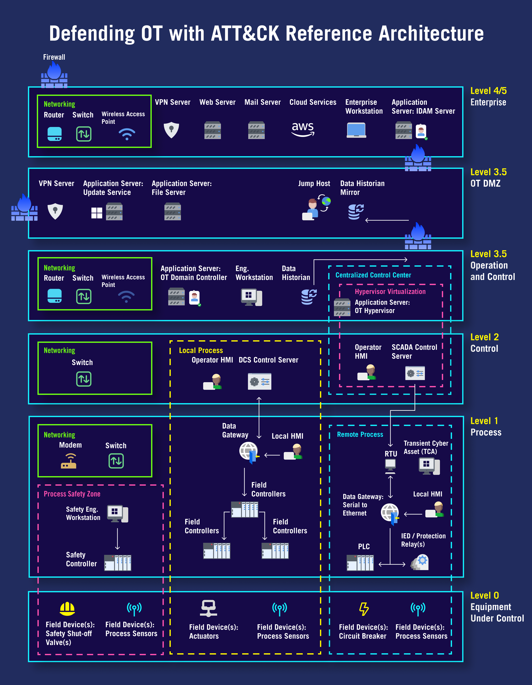
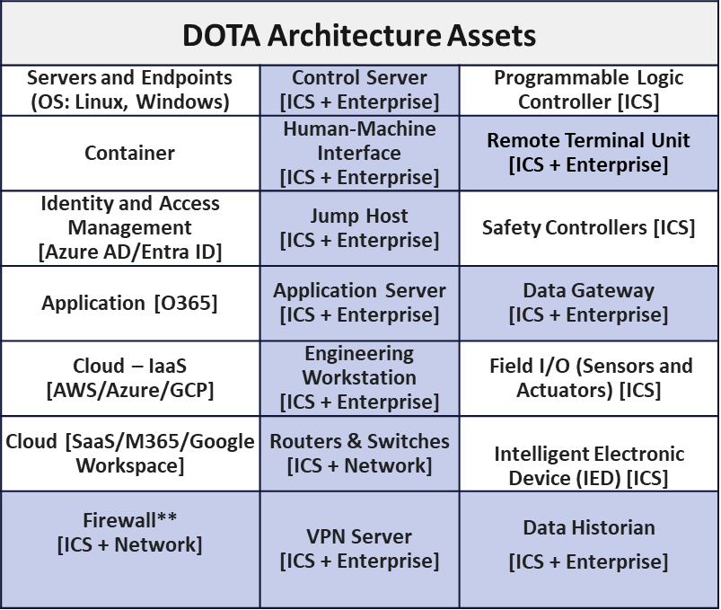

Reference Architecture
======================

Defending OT with ATT&CK developed a basic reference architecture to provide a common, 
reusable view of assets and technologies used in IT/OT hybrid environments where a threat 
actor can impact operations. The reference architecture identifies the attack surface and 
serves as a framework for depicting assets using functional components across the technology 
stack of an OT environment in hierarchical levels. It can be used to help understand the 
segmentation of industrial processes and IT systems, delineated boundaries between different 
operational zones, and interactions between IT and OT systems. 

Building the Reference Architecture
----------------------------------------------

The Defending OT with ATT&CK reference architecture is adapted from the `Purdue Enterprise Reference Architecture (PERA) model <https://www.energy.gov/sites/default/files/2022-10/Infra_Topic_Paper_4-14_FINAL.pdf>`_, 
which historically has been the primary reference to describe the structure of OT networks. 
ATT&CK for Enterprise and ATT&CK for ICS platforms and assets were reviewed to aid in determining 
relevant assets and technologies. Consideration was also given for international standards and 
sector-based use cases (e.g., factory automation, maritime transport).

**Architecture Assets**

Control systems standards and guidance containing reference architectures with assets were reviewed 
when developing the assets that comprise Defending OT with ATT&CK's reference architecture. These sources 
include the `ISA/IEC 62443 series of standards <https://www.isa.org/standards-and-publications/isa-standards/isa-iec-62443-series-of-standards>`_ for protecting industrial automation and control systems (IACS) 
from cyberthreats and `NIST SP 800-82 Rev. 3: Guide to Operational Technology (OT) Security <https://csrc.nist.gov/pubs/sp/800/82/r3/final>`_ which 
encompasses security for a broad range of systems and devices. The following considerations were also 
taken when defining the Defending OT with ATT&CK's architecture assets:

* Enterprise IT and OT Security

  *  Enterprise IT and OT security attack surface management, OT and ICS areas of interest, 
     network assets, wireless protocols in energy sector, manufacturing systems

* Network Segmentation, Governance, and Compliance

  * Measured inclusion due to the limitations of mapping these assets to attack vectors

* Architecture and Attack Vectors

  * Abstraction of cloud OT and on-prem OT to account for different attack vectors

* Adversaries and Goals in IT compared to OT

  * Distinction emphasized between IT networks where adversaries seek information exfiltration 
    and OT networks where objectives are focused on operations disruption

* Impacting ICS

  * Understanding impact to assets, particulary in context of ICS and application of ATT&CK 
    in IT and OT environments

The below table provides descriptions for each of the Defending OT with ATT&CK Architecture Assets. All assets can be mapped to 
ATT&CK for Enterprise's platforms and/or ATT&CK for ICS' assets.

+--------------------------------------+---------------------------------------------------------------------------------------------------+
+ Asset Name                           + Description                                                                                       +
+======================================+===================================================================================================+
+ Application                          + O365 is a family of applications by Microsoft including productivity software, collaboration, and +
+ [O365]                               + cloud-based services.                                                                             +
+--------------------------------------+---------------------------------------------------------------------------------------------------+
+ Application Server                   + Application servers are used across many different sectors to host various diverse software       +
+ [ICS & Enterprise]                   + applications necessary to supporting the ICS. Example functions can include data analytics and    +
+                                      + reporting, alarm management, and the management/coordination of different control servers. The    +
+                                      + application server typically runs on a modern server operating system (e.g., MS Windows Server).  +
+--------------------------------------+---------------------------------------------------------------------------------------------------+
+ Cloud - IaaS                         + IaaS, or Infrastructure as a Service, is a cloud computing model that provides on-demand access   +
+ [AWS/Azure/GCP]                      + to computing resources such as servers, storage, networking, and virtualization.                  +
+--------------------------------------+---------------------------------------------------------------------------------------------------+
+ Cloud                                + Cloud services are infrastructure, platforms, or software that are hosted on-premise or by        +
+ [SaaS/M365/Google Workspace]         + third-party providers, made available to users through network connections and/or APIs.           +
+--------------------------------------+---------------------------------------------------------------------------------------------------+
+ Container                            + A container is standard unit of virtualized software that packages up code and its dependencies   +
+                                      + so the application runs quickly and reliably from one computing environment to another.           +
+--------------------------------------+---------------------------------------------------------------------------------------------------+
+ Control Server                       + Control servers are typically a software platform that runs on a modern server operating system   + 
+ [ICS & Enterprise]                   + (e.g., MS Windows Server). The server typically uses one or more automation protocols (e.g.,      +
+                                      + Modbus, DNP3) to communicate with the various low-level control devices such as Remote Terminal   +
+                                      + Units (RTUs) and Programmable Logic Controllers (PLCs). The control server also usually provides  +
+                                      + an interface/network service to connect with an HMI.                                              +
+--------------------------------------+---------------------------------------------------------------------------------------------------+
+ Data Gateway                         + Data Gateway is a device that supports the communication and exchange of data between different   +
+ [ICS & Enterprise]                   + systems, networks, or protocols within the ICS. Different types of data gateways are used to      +
+                                      + perform various functions, including Protocol Translation, Media Converter, and Data Aggregation. +
+                                      + Data gateways are often critical to the forwarding/transmission of critical control or monitoring +
+                                      + data within the ICS. Further, these devices often have remote various network services that are   +
+                                      + used to communicate across different zones or networks.                                           +
+--------------------------------------+---------------------------------------------------------------------------------------------------+
+ Data Historian                       + Data historians, or historian, are systems used to collect and store data, including telemetry,   +
+ [ICS & Enterprise]                   + events, alerts, and alarms about the operational process and supporting devices. The historian    +
+                                      + typically utilizes a database to store this data, and commonly provide tools and interfaces to    +
+                                      + support the analysis of the data. Data historians are often used to support various engineering   +
+                                      + or business analysis functions and therefore commonly needs access from the corporate network.    +
+                                      + Data historians often work in a hierarchical paradigm where lower/site level historians collect   +
+                                      + and store data which is then aggregated into a site/plant level historian. Therefore, data        +
+                                      + historians often have remote services that can be accessed externally from the ICS network.       +
+--------------------------------------+---------------------------------------------------------------------------------------------------+
+ Engineering Workstation (EWS)        + An Engineering Workstation (EWS) is used to perform various maintenance, configuration, or        +
+ [ICS & Enterprise]                   + diagnostics functions for a control system. The EWS will likely require dedicated application     +
+                                      + software to interface with various devices (e.g., RTUs, PLCs), and may be used to transfer data   +
+                                      + or files between the control system devices and other networks.                                   +
+--------------------------------------+---------------------------------------------------------------------------------------------------+
+ Field I/O (Sensors and Actuators)    + Field I/O are devices that communicate with a controller or data aggregator to either send input  +
+ [ICS]                                + data or receive output data. Input data may include readings about a given environment/device     +
+                                      + state from sensors, while output data may include data sent back to actuators for them to either  +
+                                      + undertake actions or change parameter values. These devices are frequently embedded devices       +
+                                      + running on lightweight embedded operating systems or RTOSes.                                      +
+--------------------------------------+---------------------------------------------------------------------------------------------------+
+ Firewall                             + A firewall is a network security system, running locally on an endpoint or remotely as a service  +
+ [ICS & Network]                      + (e.g., cloud environment), that monitors and controls incoming/outgoing network traffic based     +
+                                      + on predefined rules.                                                                              +
+--------------------------------------+---------------------------------------------------------------------------------------------------+
+ Human-Machine Interface (HMI)        + HMIs are systems used by an operator to monitor the real-time status of an operational process    +
+ [ICS & Enterprise]                   + and to perform necessary control functions, including the adjustment of device parameters. An HMI +
+                                      + can take various forms, including a dedicated screen or control panel integrated with a specific  +
+                                      + device/controller, or a customizable software GUI application running on a standard operating     +
+                                      + system (e.g., MS Windows) that interfaces with a control/SCADA server. The HMI is critical to     +
+                                      + ensuring operators have sufficient visibility and control over the operational process.           +
+--------------------------------------+---------------------------------------------------------------------------------------------------+
+ Identity and Access Management       + Identity and access management systems to determine whether a user should be granted access       +
+ [Azure AD/Entra ID]                  + to a resource.                                                                                    +
+--------------------------------------+---------------------------------------------------------------------------------------------------+
+ Intelligent Electronic Device (IED)  + An IED is a type of specialized field device that is designed to perform specific operational     +
+ [ICS]                                + functions, frequently for protection, monitoring, or control within the electric sector. IEDs are +
+                                      + typically used to both acquire telemetry and execute tailored control algorithms/actions based on +
+                                      + customizable parameters/settings. An IED is usually implemented as a dedicated embedded device    +
+                                      + and supports various network automation protocols to communicate with RTUs and Control Servers.   +
+--------------------------------------+---------------------------------------------------------------------------------------------------+
+ Jump Host                            + Jump hosts are devices used to support remote management sessions into ICS networks or devices.   +
+ [ICS & Enterprise]                   + The system is used to access the ICS environment securely from external networks, such as the     +
+                                      + corporate network. The user must first remote into the jump host before they can access ICS       +
+                                      + devices. The jump host may be a customized Windows server using common remote access protocols    +
+                                      + (e.g., RDP) or a dedicated access management device. The jump host typically performs various     +
+                                      + security functions to ensure the authenticity of remote sessions, including authentication,       +
+                                      + enforcing access controls/permissions, and auditing all access attempts.                          +
+--------------------------------------+---------------------------------------------------------------------------------------------------+
+ Programmable Logic Controller (PLC)  + A PLC is an embedded programmable control device. PLCs typically utilize a modular architecture   +
+ [ICS]                                + with separate modules used to support its processing capabilities, communication mediums, and I/O +
+                                      + interfaces. PLCs allow for the deployment of customized programs/logic to control or monitor an   +
+                                      + operational process. This logic is defined using industry specific programming languages, such as +
+                                      + IEC 61131 , which define the set of tasks and program organizational units (POUs) included in the +
+                                      + device’s programs. PLCs also typically have distinct operating modes (e.g., Remote, Run, Program, +
+                                      + Stop) which are used to determine when the device can be programmed or whether it should execute  +
+                                      + the custom logic.                                                                                 +
+--------------------------------------+---------------------------------------------------------------------------------------------------+
+ Remote Terminal Unit (RTU)           + An RTU is a device that typically resides between field devices (e.g., PLCs, IEDs) and control/   +
+ [ICS & Enterprise]                   + SCADA servers and supports various communication interfacing and data aggregation functions. RTUs +
+                                      + are typically responsible for forwarding commands from the control server and the collection of   +
+                                      + telemetry, events, and alerts from the field devices. An RTU can be implemented as a dedicated    +
+                                      + embedded device, as software platform that runs on a hardened/ruggedized computer, or using a     +
+                                      + custom application program on a PLC.                                                              +
+--------------------------------------+---------------------------------------------------------------------------------------------------+
+ Routers & Switches                   + A computer that is a gateway between two networks at OSI layer 3 and that relays and directs data +
+ [ICS & Network]                      + packets through that inter-network. The most common form of router operates on IP packets.        +
+--------------------------------------+---------------------------------------------------------------------------------------------------+
+ Safety Controllers                   + Safety controllers are typically a type of field device used to perform the safety critical       +
+ [ICS]                                + function. Safety controllers often support the deployment of custom programs/logic, similar to a  +
+                                      + PLC, but can also be tailored for sector specific functions/applications. The safety controllers  +
+                                      + typically utilize redundant hardware and processors to ensure they operate reliably if a          +
+                                      + component fails.                                                                                  +
+--------------------------------------+---------------------------------------------------------------------------------------------------+
+ Servers and Endpoints                + A server is a system that provides resources, data, services, or programs to other systems over a +
+ [OS: Linux, Windows]                 + network. Endpoints are physical devices that connect to and exchange information with a network.  +
+--------------------------------------+---------------------------------------------------------------------------------------------------+
+ Virtual Private Network (VPN) Server + A VPN server is a device that is used to establish a secure network tunnel between itself and     + 
+ [ICS & Enterprise]                   + other remote VPN devices, including field VPNs. VPN servers can be used to establish a secure     +
+                                      + connection with a single remote device, or to securely bridge all traffic between two separate    + 
+                                      + networks together by encapsulating all data between those networks. VPN servers typically support +
+                                      + remote network services that are used by field VPNs to initiate the establishment of the secure   +
+                                      + VPN tunnel between the field device and server.                                                   +
+--------------------------------------+---------------------------------------------------------------------------------------------------+

