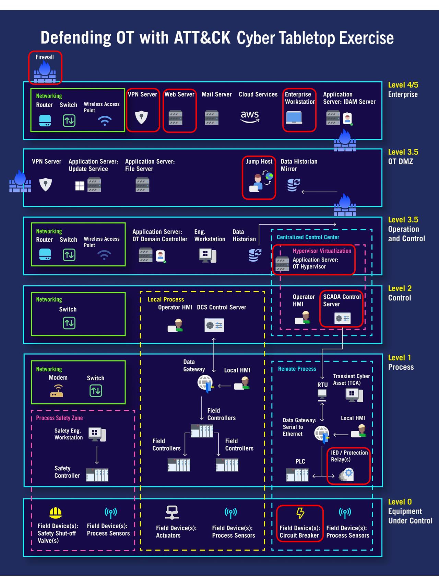
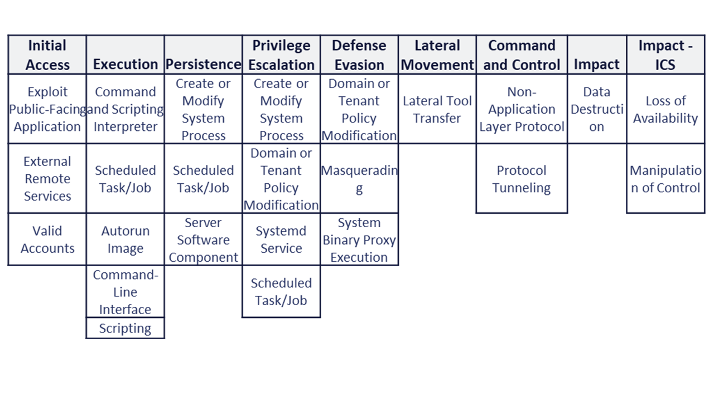
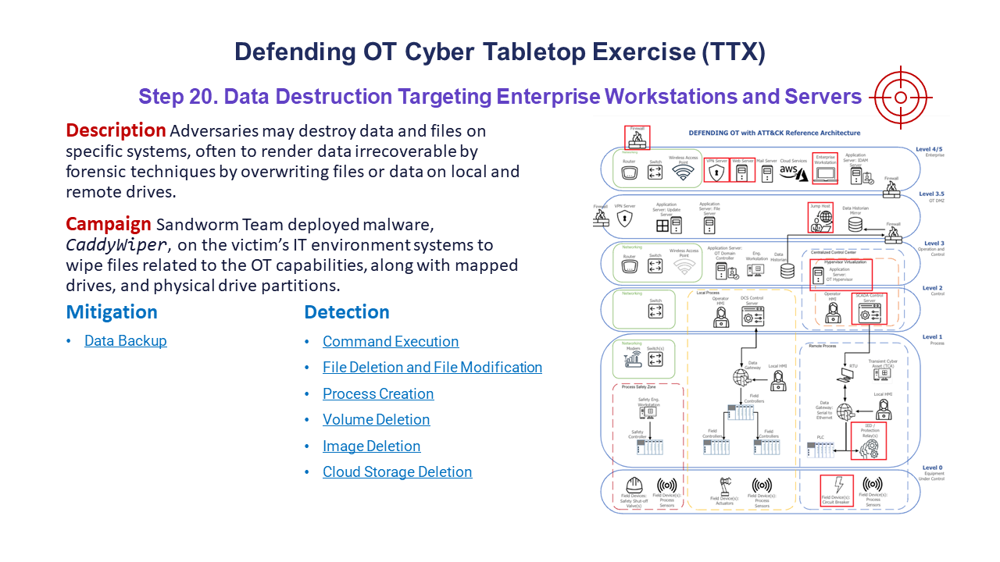

Cyber Tabletop Exercise
=======================

Organizations need to proactively understand how to defend against advanced persistent
threat techniques that can be used to impact their operational technology (OT)
environment, regardless of whether these cyber-attacks affect assets within different
technology domains. To demonstrate how this project's resources can be used to meet that
need, a cyber tabletop exercise was conducted by project participants. Exercise goals
included assessing and improving information technology (IT) and OT defensive strategies
for advanced nation state threat actor groups that use adversarial techniques
overlapping Enterprise and Industrial Control Systems (ICS) domains.

The ATT&CK-based tabletop exercise scenario was based upon the `2022 Ukraine Electric
Power Attack <https://attack.mitre.org/campaigns/C0034/>`_ campaign. This real-world
campaign by the Russian threat actor group known as Sandworm Team used a combination of
malware and 15 ATT&CK techniques overlapping ATT&CK for Enterprise and ICS domains to
gain access to a Ukranian electric utility and send unauthorized commands to substation
devices, disrupting power across Ukraine. The attackers targeted IT environment systems
and used those system to conduct attacks against OT capabilities.

During the exercise, project participants reviewed 20 ATT&CK techniques observed during
this adversarial campaign and the associated technical risks. This involved a detailed
review of each adversarial behavior, assets impacted in architecture, and mitigating
cyber defense guidance to minimize the risk. This information was used to score
potential adversarial risk, along with the protective and detective security mechanisms
captured. Upon conclusion of the exercise, participants held a brief hot wash,
identified areas of improvement for defense-in-depth, and developed recommendations for
security across multiple domains of the IT/OT environment.

Conducting the Exercise
-----------------------

The exercise was conducted using the Defending OT with ATT&CK :doc:`architecture`. This
reference architecture is depicted in the image below. Exercise participants assumed the
role of cybersecurity experts for an organization with a technical environment similar
to the hacked power plant infrastructure. Red boxes are used to indicate assets impacted
during the campaign.

  Reference Architecture (Click to enlarge)

The ATT&CK techniques investigated during the exercise are provided in the table below,
organized under tactics - the reasons an advesary performs the action. A mix of
techniques in the ATT&CK for Enterprise and ICS domains were used to infiltrate the
electric utility and then send unauthorized commands from their SCADA (supervisory
control and data acquisition) control system architecture.

  ATT&CK Matrix for this Campaign (click to enlarge)

The following depicts an example of the presentation of adversarial threats for
participant discussion and evaluation, including consideration of potential mitigations,
detection methods, and risk scenarios:

  Example Step from Tabletop Exercise (click to enlarge)

Defensive Takeaways
-------------------

* Emphasize a threat-informed approach when evaluating the defense-in-depth of
  organizational security controls, particularly when securing and hardening enterprise
  assets. This was highlighted in the assessment of how threat actors exploit
  internet-facing assets during the initial stages of the cyber kill chain.

  * Without a threat-informed approach, security controls may not effectively address
    specific vulnerabilities exploited by threat actors, increasing the risk of
    successful cyber attacks.

* Stress the importance of baselining and maintaining situational awareness in your
  operational environment through continuous monitoring of sensor health and status.
  This is crucial for identifying threat actor behaviors, including the use of living
  off the land (LoTL) techniques that blend with normal operational activities.

  * Inadequate baselining and monitoring may lead to delayed detection of stealthy
    threat actor activities, potentially resulting in prolonged compromise and data
    exfiltration.

* Prioritize privileged account management for shared administrator accounts and
  validate network segmentation across various zones, from enterprise (level 5) to
  operational and control (level 3), to mitigate lateral movement by threat actors or
  ingress of malicious artifacts.

  * Poor privileged account management and inadequate network segmentation increase the
    risk of unauthorized access and lateral movement within the network, potentially
    leading to widespread compromise and data breach.

Offensive Takeaways
-------------------

* Consider repeating this exercise based on other cyber-attacks on Ukrainian Electric
  Plants in 2016 and 2020, and reviewing techniques associated with the Russian threat
  actor Sandworm.

  * Ignoring historical attack patterns and specific threat actor techniques may result
    in overlooking critical vulnerabilities and attack vectors, leaving the organization
    vulnerable to similar cyber attacks.

* Plan the next steps with a hands-on purple team exercise, where selected adversarial
  techniques are executed by a red team or programmatically using tools like Caldera and
  Caldera for OT. Evaluate the effectiveness of security controls and have the results
  assessed by a blue team of cyber-defenders.

  * Without conducting a hands-on purple team exercise, the effectiveness of current
    security controls may not be accurately assessed, leading to gaps in defensive
    capabilities and increased exposure to cyber threats.
