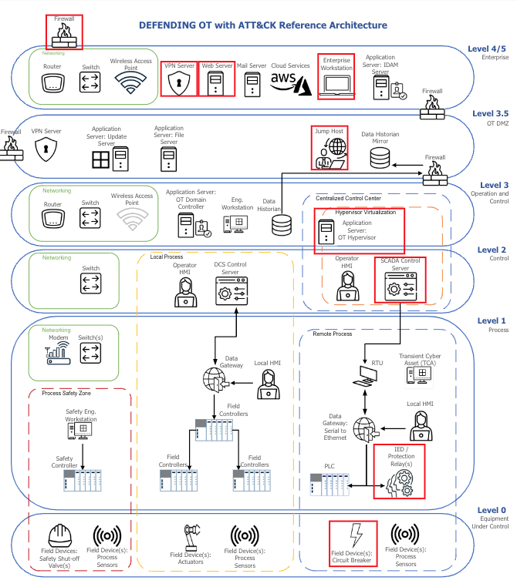

Cyber Tabletop Exercise
=======================

Organizations need to proactively understand how to defend against advanced 
persistent threat techniques that can be used to impact their operational 
technology (OT) environment, regardless of whether these cyber-attacks affect 
assets within different domains such as Enterprise and ICS. To demonstrate how 
this project's resources can be used to meet that need, a cyber tabletop exercise 
was conducted byproject participants.

to assess and improve IT/OT defensive strategies for
advanced nation state threat actor groups that use adversarial techniques 
overlapping Enterprise and ICS domains

The ATT&CK-based tabletop exercise scenario was based upon the 
`2022 Ukraine Electric Power Attack<https://attack.mitre.org/campaigns/C0034/>_` campaign. This real-world campaign by the 
Russian threat actor group known as Sandworm Team used a combination of malware 
and 15 ATT&CK techniques overlapping ATT&CK for Enterprise and ICS domains to gain 
access to a Ukranian electric utility and send unauthorized commands to substation 
devices, disrupting power across Ukraine. The attackers targeted IT environment 
systems and used those system to conduct attacks against OT capabilities.

During the exercise, project participants reviewed 20 ATT&CK techniques observed 
during this adversarial campaign and the associated technical risks. This involved a 
detailed review of each adversarial behavior, assets impacted in architecture, and 
mitigating cyber defense guidance to minimize the risk. This information was used to 
score potential adversarial risk, along with the protective and detective security 
mechanisms captured. Upon conclusion of the exercise, participants held a brief hot wash, 
identified areas of improvement for defense-in-depth, and developed recommendations 
for security across multiple domains of the IT/OT environment.

Environment
-----------

The exercise was conducted using the Defending OT with ATT&CK `reference architecture<./architecture.rst>_`. 
This reference architecture is depicted in the image below. Exericse participants 
assumed the role of cybersecurity experts for an organization with a technical environment 
similar to the hacked power plant infrastructure. Red boxes are used to indicate 
assets impacted during the campaign.

The ATT&CK techniques investigated during the exercise are provided in the table below, 
organized under tactics - the reasons an advesary performs the action. A mix of techniques 
in the ATT&CK for Enterprise and ICS domains were used to infiltrate the electric utility 
and then send unauthorized commands from their SCADA (supervisory control and data acquisition)
control system architecture. 

.. image:: ./_static/campaign.png

Results
-------

<<TO DO>>
Used real-world example to identify and understand the best defensive capabilities to counter these threats. 
Envision that we have proactively constructed an ATT&CK driven defense incorporating all framework recommendations.
Survey results
