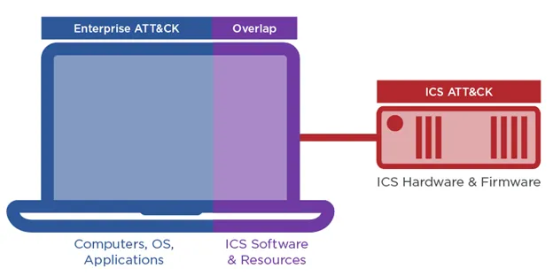

Overview
========

Organizations need to understand which techniques adversaries can use against 
Operational Technology (OT) systems. This includes:

* techniques that occur on enterprise systems used to manage OT,

* techniques on Industrial Control Systems (ICS), and

* techniques on OT assets that run similar operating systems, protocols, and applications as enterprise IT assets.

Defending OT with ATT&CK provides a customized collection of MITRE ATT&CK® techniques 
tailored to the attack surface and threat model for OT environments. Historical attacks 
against OT and adversarial tactics, techniques, and procedures (TTPs) as contained in 
ATT&CK for Enterprise, ATT&CK for ICS, and other relevant ATT&CK datasets such as Cloud 
and Containers were analyzed to identify and define a reference architecture and technology 
domains of interest specific to OT. The resultant collection can be used by organizations 
that use OT to evaluate, plan, and employ security controls based on known, real-world 
adversary behaviors targeting those environments.

Background
----------
`MITRE ATT&CK® <https://attack.mitre.org/>`_ is a globally accessible knowledge 
base of cyber adversary tactics and techniques based on public reporting and 
observation. The ATT&CK knowledge base represents adversary goals as tactics 
and specific goal-oriented behaviors as techniques and sub-techniques. Defending 
OT with ATT&CK leverages the knowledgebase and its underlying data model to 
produce a collection of ATT&CK techniques tailored to OT environments.

Initially, ATT&CK was focused on the Windows enterprise environment. Later versions 
integrated macOS and Linux into what is commonly known as ATT&CK for Enterprise. 
With broader adoption and numerous contributions from the cybersecurity community, 
ATT&CK eventually added Mobile and ICS technology domains.

A typical OT environment spans multiple platforms (e.g., Linux and Microsoft Azure) 
and even spans technology domains (e.g., Enterprise and ICS). These complex environments 
require cyber defenders to track adversary behaviors that are defined across multiple 
matrices and platforms in the ATT&CK knowledgebase. Keeping track of techniques across 
different ATT&CK matrices can be difficult, and some techniques may not apply to a 
particular environment or architecture. To that end, this project defines a reference 
architecture and a corresponding attack surface, then creates mappings of relevant 
techniques from multiple matrices to provide a single, convenient collection of resources.

Prior research into communicating adversary behaviors facing OT networks was conducted by 
`Mandiant Threat Intelligence and MITRE <https://cloud.google.com/blog/topics/threat-intelligence/gestalt-mitre-attack-ics/>`_. The analyis included techniques contained in 
ATT&CK for Enterprise and ATT&CK for ICS, represented in a hybrid view of the complexity of events 
across the OT Targeted Attack Lifecycle. The figure below reflects the differences and overlaps 
between ATT&CK for Enterprise and ATT&CK for ICS.

Get Involved
-----------

This project provides the community with resources for understanding of the attack surface 
and threat model for various assets within a hybrid IT/OT architecture and environment. There are 
several ways that you can get involved with this project and help advance threat-informed defense:

* **Use the project resources.** Visit the :doc:`architecture` and :doc:`collection` to learn how the project resources are constituted and how you can use them.

* **Apply the methodology.** The Defending OT resources are usable as-is, but you can also learn how to create your own customized collections by following the :doc:`methodology`.

* **Build and share your own collections.** Use `ATT&CK Workbench <https://github.com/center-for-threat-informed-defense/attack-workbench-frontend/blob/master/README.md>`_  to build your own collections. You can use custom collections privately or publish them to benefit the community.

* **Tell us what you think.** Let us know how you're using the project and what ideas you have to improve it. Please see the `guidance for contributors <https://github.com/center-for-threat-informed-defense/defending-ot-with-attack/blob/main/CONTRIBUTING.md>`_ if are you interested in contributing or reporting issues.